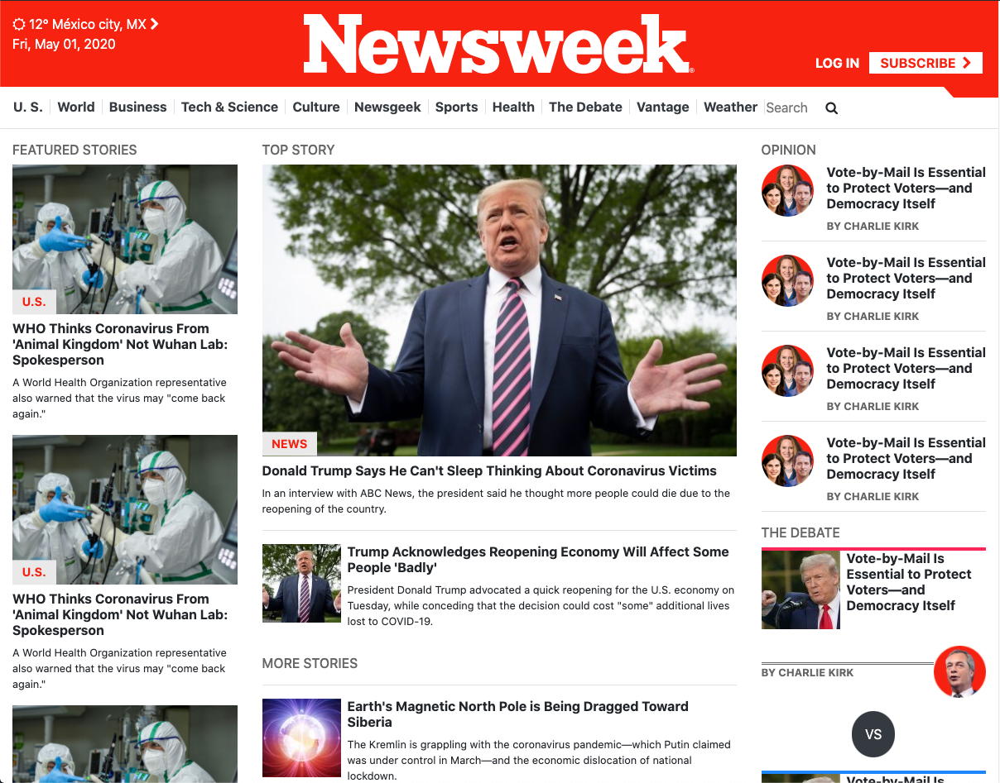

# Newsweek clone project

> This project is a clone of the newsweek page which is mainly using bootstrap for frontend. I use bootstrap classes instead of CSS (almost).

## Built With

- HTML, CSS
- Bootstrp framework

## Live Demo

[Live Demo Link](https://rawcdn.githack.com/emasdev/newsweek-clone/5911050d8ed3774387794055b7ca8cf46481391f/index.html)

## Authors

👤 **Emanuel**

- Github: [@githubhandle](https://github.com/emasdev)
- Twitter: [@twitterhandle](https://twitter.com/elemass)

## 🤝 Contributing

Contributions, issues and feature requests are welcome!

Feel free to check the [issues page](issues/).

## Show your support

Give a ⭐️ if you like this project!

## Acknowledgments

- Microverse Inc.

## 📝 License

This project is [MIT](lic.url) licensed.
